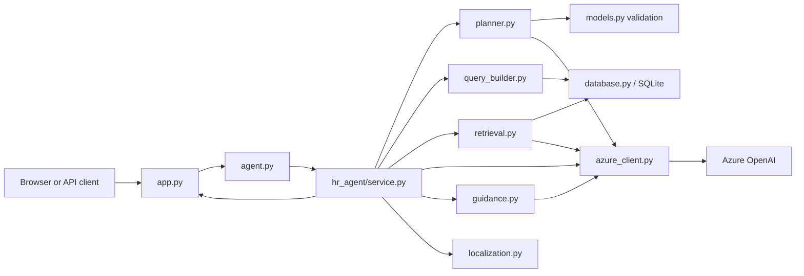

# HR Data QA Agent

This service answers HR questions from structured CSV data and performance-review
text. Azure OpenAI interprets the complete question and audits the resulting
plan; the application—not the model—builds parameterized SQL and controls which
review evidence may be returned.

## Workflow



### Application startup

1. `app.py` reads environment settings, loads the CSV filename configuration,
   creates FastAPI, and registers the UI and API routes.
2. The first question passes through `agent.py` to the cached service in
   `hr_agent/service.py`.
3. The service loads the three CSV files into in-memory SQLite through
   `database.py`.
4. `retrieval.py` embeds the raw, non-empty performance reviews and builds a
   FAISS index, or an equivalent NumPy index when FAISS is unavailable.
5. The database and review index are reused for later requests in that process.

### Every question

1. `app.py` validates the HTTP request and calls `agent.hr_agent_with_trace()`.
2. `agent.py` forwards it to `HRAgentService.answer_with_trace()`.
3. `service.py` safely normalizes the question and asks `planner.py` for a typed
   plan.
4. `planner.py` sends the complete question to Azure, `models.py` validates the
   returned plan and its boundary category against closed schemas, and an
   independent Azure call audits it. One issue-directed replan is allowed;
   invalid output fails safely.
5. The audited plan selects one of three paths:

   | Route | Work performed |
   | --- | --- |
   | `sql_only` | `query_builder.py` builds allowlisted, parameterized SQL; `database.py` executes it. |
   | `review_semantic` | `retrieval.py` finds review candidates, then Azure keeps only directly supported evidence. |
   | `review_semantic_plus_sql` | Review evidence is found first; its employee IDs become SQL parameters so structured filters and semantic evidence are intersected. |

6. `service.py` formats the deterministic result and evidence trace. For vague
   or unsupported requests, `guidance.py` receives only the audited category and
   available schema and produces a grounded explanation or clarification. Azure
   cannot add new facts.
7. `localization.py` translates only exact empty or unsupported status messages;
   `app.py` returns the final JSON response.

Routing is based on the validated Azure plan, not a synonym or keyword list.
Azure never writes or executes SQL, and embedding similarity alone is never
treated as final evidence.

## File map

The production Python files run in the sequence described above:

| File | Purpose |
| --- | --- |
| `app.py` | FastAPI entry point, request validation, authentication controls, headers, health/readiness, question, data, and download endpoints. |
| `agent.py` | Small backward-compatible facade exposing `hr_agent()` and `hr_agent_with_trace()`. |
| `hr_agent/__init__.py` | Public package exports; it performs no work by itself. |
| `hr_agent/settings.py` | Reads Azure and application environment variables and reports configuration readiness. |
| `hr_agent/azure_client.py` | Central Azure chat and embedding HTTP client with response validation, timeout, and bounded retry. |
| `hr_agent/database.py` | Loads configured CSVs into in-memory SQLite, executes parameterized queries, and supplies raw review records. |
| `hr_agent/guidance.py` | Turns audited vague/out-of-scope categories into schema-grounded explanations and suggested questions, with strict validation and safe fallback. |
| `hr_agent/models.py` | Immutable plan types and strict validation for routes, fields, filters, grouping, ordering, language, and semantic scope. |
| `hr_agent/planner.py` | Versioned planning/auditing prompts, prompt hashes, closed repair policy, and bounded replan flow. |
| `hr_agent/query_builder.py` | Converts only validated plans into trusted SQL identifiers plus parameter values; it never executes model-generated SQL. |
| `hr_agent/retrieval.py` | Embeds raw reviews, searches FAISS/NumPy, and uses an evidence classifier to reject similarity-only matches. |
| `hr_agent/localization.py` | Fixed translations for exact empty and unsupported statuses only. |
| `hr_agent/service.py` | Coordinates planning, retrieval, SQL execution, result formatting, evidence, localization, and optional answer phrasing. |

Supporting files:

| Path | Purpose |
| --- | --- |
| `hr_data_files.json` and `*.csv` | Data-file mapping and the employees, departments, and absences sources. |
| `templates/` and `static/` | Browser UI, curated example questions, styles, and client-side API calls. |
| `tests/` | Local unit/regression tests and opt-in live Azure evaluations. |
| `docs/evaluation.md` | Detailed architecture evaluation, prompt identities, Azure usage, and holdout results. |
| `.github/workflows/ci.yml` | Python 3.11 continuous-integration checks. |

## Configuration

Python 3.11 is recommended. Set these required values in the shell or in the
Render service's **Environment** settings:

```text
AZURE_OPENAI_ENDPOINT
AZURE_OPENAI_DEPLOYMENT
AZURE_OPENAI_API_VERSION
AZURE_OPENAI_API_KEY
AZURE_OPENAI_EMBEDDING_DEPLOYMENT
```

Optional controls:

```text
HR_AGENT_API_KEY=
HR_AGENT_EXPOSE_EVIDENCE=true
HR_AGENT_ENABLE_DATA_ENDPOINTS=true
HR_AGENT_DEBUG=false
```

`.env.example` documents runtime variable names. Live Azure test scripts load
credentials from the ignored `.env.test`; neither credentials file should be
committed. For real employee data, use TLS and SSO/RBAC, suppress evidence and
source-data endpoints unless needed, and keep secrets only in the deployment
environment.

## Run locally

```powershell
python -m pip install -r requirements.txt
$env:AZURE_OPENAI_ENDPOINT="https://..."
$env:AZURE_OPENAI_DEPLOYMENT="..."
$env:AZURE_OPENAI_API_VERSION="..."
$env:AZURE_OPENAI_API_KEY="..."
$env:AZURE_OPENAI_EMBEDDING_DEPLOYMENT="..."
python -m uvicorn app:app --reload
```

Open `http://127.0.0.1:8000`.

Run the network-free checks with:

```powershell
python -m unittest discover -s tests -p "test_*.py"
python -m compileall -q app.py agent.py hr_agent tests
node --check static/app.js
```

API endpoints are `POST /ask`, `GET /health`, `GET /ready`, and—when enabled—
`GET /data/{table_name}` and `GET /download/{table_name}`. See
[`docs/evaluation.md`](docs/evaluation.md) before running the optional paid Azure
evaluation scripts.
